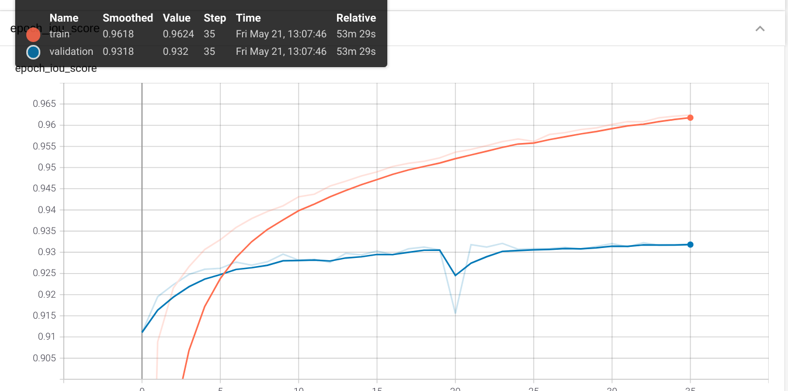
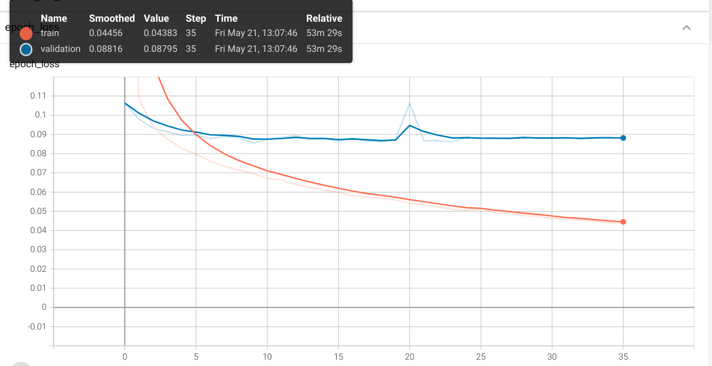

# cats_dogs_segmentation

Scripts for training and testing convolutional neural network for images segmentation.

This script builds models using this library "https://github.com/qubvel/segmentation_models". Using this library made 
it possible to quickly test various models and choose the best option for solving the segmentation problem.

You can view or set parameters in config.py
    
To train the model, the "Oxford IIIT Pet Dataset" was used.
The Oxford-IIIT Pet Dataset is a 37 category pet dataset with roughly 200 images for each class created by the Visual 
Geometry Group at Oxford. The images have a large variations in scale, pose and lighting. All images have an 
associated ground truth annotation of breed, head ROI, and pixel level trimap segmentation. Below is a link to the 
dataset.
> https://www.robots.ox.ac.uk/~vgg/data/pets/

## 1. Dataset preparation
My dataset has this configuration:
```
data/
    annotations/
            masks/
                ...
            xmls/
                ...
            list.txt
            test.txt
            trainval.txt     
    images/
            Abyssinian_1.jpg
            Abyssinian_2.jpg
            ...
``` 
Run this script to prepare dataset for training and testing:
```shell script
python data_preparation.py
```
## 2. Training
Run training script with default parameters:
```shell script
python train.py
```
## 3. Plotting graphs
If you want to build graphs from saved logs, you can use tens or board by passing the path to the logs folder.
```shell script
tensorboard --logdir models_data/tensorboard_logs/Linknet_imagenet_2021-05-18_20-48-16_False
```
## 4. Testing
You can test the model using a webcam.
For visualization, you need to pass two arguments "--weights ". In the output image, you will see the segmentation 
mask.
```shell script
python test_model_real_time.py --weights models_data/save_models/Linknet_imagenet_2021-05-18_18-42-54_True/Linknetefficientnetb0.h5
```
The frame from the real test is shown below.


## Results
### Model Linknet with backbone efficientnetb0.
The graphs show metrics during model training with loaded "imagenet" weights. The orange line is train, the blue 
line is val
Prediction examples:

This is iou_score metric.


This is loss.



